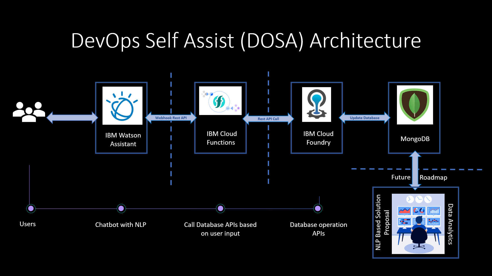

# DevOps Self Assist (DOSA)

## Introduction
DevOps Self Assist is a chatbot based solution to collect the data from users about their current DevOps pain points and propose a potential solution addressing their pain areas. The data collected from users will also be used for data analytics and build an NLP model to do the training on DevOps solution proposals.

The prototype of the chatbot is embedded in the <a href="./DevOps_Assist_Prototype.html"><b>DevOps_Assist_Prototype.html</b></a> file.  To use it, open the html file and click on the bottom right chat button.

## Architecture

## IBM Watson Assistant
The Chatbot is developed using IBM Watson Assistant service. The source code on the IBM Watson Assistant skill is available in <b>IBM_Watson_Assistant</b> folder. Currently we are using NLP from IBM Watson Assistant to classify the tools used.  This is a prototype and we are working adding more NLP to the chatbot.  The chatbot is having a webhook to a Rest API function.  The function will decide on which database operation API to be called, to dumb the data based on the inputs from the user.

## IBM Cloud functions
IBM Cloud function service is used to create the Rest API function to call the Database operation APIs to dump the customer data.  The source code for the IBM Cloud function is available in the folder <b>IBM_Cloud_Function</b>.  The source is written in NodeJS.

## IBM Cloud Foundry
IBM Cloud Foundry service is used to deploy the Python-Flask application for Database operation Rest APIs. The source code and the endpoint details of the Python-Flask Rest APIs are available in the <b>IBM_Cloud_Foundry</b> folder. The APIs are for data operations on MongoDB database which is hosted in the MongoDB Atlas cloud.

## MongoDB Database
MongoDB database is used to dumb the data from users.  The database is hosted in the MongoDB Atlas cloud.

## Data Analytics and NLP model (Future roadmap)
The data dumped in MongoDB will be used in analytics to:
* Understand various pain areas based on geography, business areas, tools etc. for decision taking assistance
* Categorize the customer sentiments for various tools and features for improvising our tools
* Build a more robust NLP model for solution proposal and addressing customer pain areas

## Contributor List
<b>[Madhu B A](mailto:madhu.b.a@in.ibm.com?subject=[GitHub]%20DOSA%20-%20DevOps%20Self%20Assist)</b> 
<b>[Anjali Abraham](mailto:anjaabr1@in.ibm.com?subject=[GitHub]%20DOSA%20-%20DevOps%20Self%20Assist)</b> 
<b>[Anuprakash Moothedath](mailto:anuprakash.moothedath@ibm.com?subject=[GitHub]%20DOSA%20-%20DevOps%20Self%20Assist)</b> 
